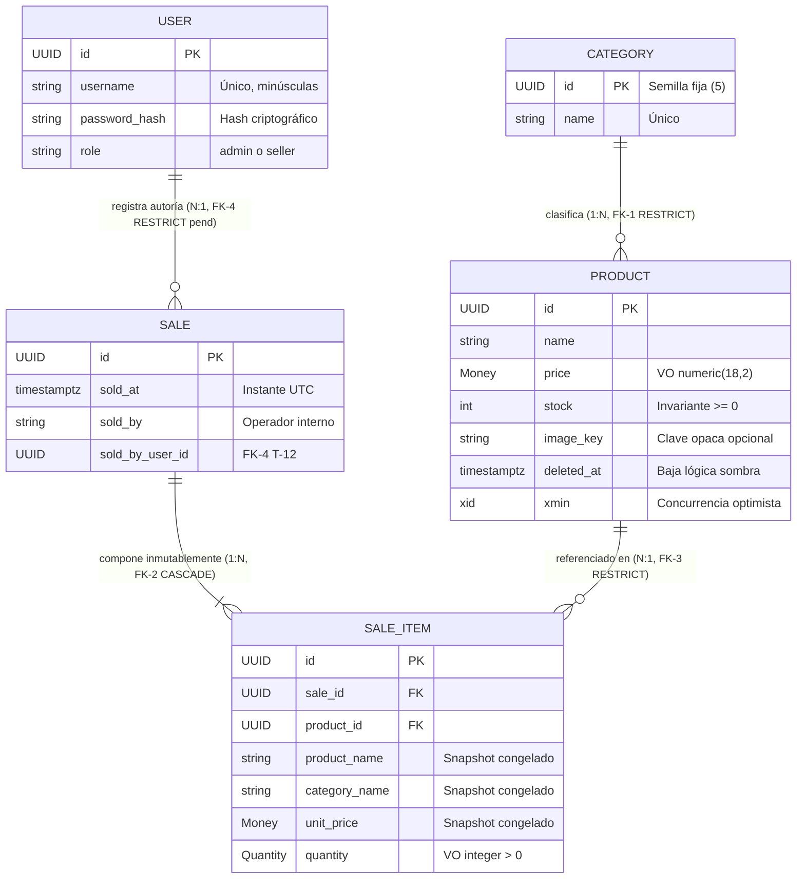

# 02 — Modelo de Dominio: Simple Stock Flow

> **Reto SDD · Ficha ADSO 3239188**  
> **Fase 4 de 6:** Reconstrucción del Modelo Táctico de Dominio desde el Modelo de Datos.  
> **Único insumo base:** [`spec/data-model.md`](../spec/data-model.md).  
> **Regla de Trazabilidad:** Toda entidad, objeto de valor, regla invariante y evento se extrae directamente de las especificaciones y contratos de `spec/data-model.md` (`§1`, `§2`, `§4`, `§5`, `D-05`, `D-06`, `D-07`, `D-09`, `ADR-002`, `ADR-004`). Lo deducido conceptualmente se etiqueta como **`[Supuesto]`**.

---

## Índice de Documentos de esta Sección

Esta carpeta contiene la definición táctica del dominio puro (Domain-Driven Design), libre de infraestructura y ataduras de persistencia:

| Documento | Enfoque | Contenido Principal |
| :--- | :--- | :--- |
| **[entities-and-rules.md](./entities-and-rules.md)** | **Entidades, VOs e Invariantes** | Detalle de las 5 entidades (`Product`, `Sale`, `SaleItem`, `User`, `Category`), los Value Objects (`Money`, `Quantity`, `DateRange`), Agregados y la especificación rigurosa de invariantes tácticas. |
| **[domain-events.md](./domain-events.md)** | **Eventos de Dominio** | Catálogo formal de hechos consumados del negocio (`SaleConfirmed`, `StockWithdrawn`, `ProductOutOfStock`, `ProductPriceChanged`, `ProductSoftDeleted`) con sus esquemas JSON y significado. |
| **[glossary.md](./glossary.md)** | **Lenguaje Ubicuo (Glosario)** | Definiciones funcionales y técnicas del lenguaje ubicuo del proyecto, alineadas estrictamente con §1 de la especificación. |

---

## Mapa Conceptual del Dominio

