# Visión de Producto — Simple Stock Flow

> **Documento:** `03-product/vision.md`  
> **Sistema:** Simple Stock Flow  
> **Fuente de Verdad Técnica:** [`spec/data-model.md`](../spec/data-model.md)

---

## 1. Declaración de Visión del Producto

Siguiendo la plantilla clásica de Geoffrey Moore:

* **Para** administradores y dueños de pequeños y medianos comercios de venta en mostrador (como ferreterías y almacenes técnicos),
* **Que** enfrentan descontrol de inventario, sobreventas en horas pico de caja y reportes financieros distorsionados cada vez que actualizan precios o categorías en el catálogo,
* **El sistema Simple Stock Flow**
* **Es una** aplicación web de punto de venta (POS) y control de flujo de inventario interno,
* **Que** garantiza consistencia atómica de stock en tiempo real, inmutabilidad de las ventas registradas y estabilidad absoluta de los reportes comerciales mediante congelamiento de datos de venta (*Frozen Snapshot*),
* **A diferencia de** ERPs genéricos complejos y costosos (que imponen multimoneda, pasarelas de pago externas y sobrecarga de campos forenses),
* **Nuestro producto** ofrece una solución enfocada, monomoneda, con integridad transaccional respaldada por PostgreSQL 16.14 y arquitectura hexagonal limpia sin sobreingeniería.

---

## 2. Los Cinco Principios de Producto (Innegociables)

Estos principios guían todas las decisiones de diseño y delimitación de alcance. Se derivan directamente de las decisiones de diseño cerradas en `spec/data-model.md`:

### Principio 1: El Pasado No se Reescribe (Inmutabilidad Histórica) [D-06, ADR-004, §1, §2.3, §7.1]
Una venta registrada es un **hecho consumado e inmutable**. No existen endpoints ni métodos para editar o borrar una venta [§1, §2.3]. Al registrar una línea, los nombres y precios del catálogo se copian y se congelan en `sale_item` [§2.4]. Si el catálogo cambia en el futuro, los libros contables del pasado no se tocan. Un reporte cerrado jamás cambia [§11.1].

### Principio 2: Monomoneda por Construcción (D-05) [§1, §3]
El sistema opera exclusivamente bajo una única divisa nativa. **No existe columna de moneda en ninguna tabla de la base de datos** [§1, §3]. Esta decisión elimina la complejidad de tasas de cambio, conversiones en caliente y errores de redondeo multimoneda, acelerando la operación en caja.

### Principio 3: Catálogo Esencial — Cero Grasa Funcional (DP-03) [§1, §12]
El producto tiene **nombre, precio, stock, categoría e imagen opcional, y nada más** [§1]. Se rechaza formalmente la introducción de descripciones largas, códigos SKU alternativos, marcas, códigos de barras secundarios o variantes de color/talla. Cada campo adicional en el catálogo es costo de mantenimiento que nadie solicitó.

### Principio 4: Minimización Radical de Privacidad (DP-02) [§1, §7, §7.1]
El sistema es una herramienta de uso interno. **No modela clientes finales, compradores ni medios de pago con tarjeta** [§1, §7]. La venta registra únicamente la autoría del operador interno (`sold_by`/`sold_by_username`). Para proteger al personal, el reporte comercial Q9 agrega estrictamente por producto y **prohíbe el desglose por vendedor** (DP-02 [§7, §7.1]).

### Principio 5: Integridad Respaldada en el Motor, no Solo en Promesas de Código [ADR-002, §preámbulo, §4]
Cualquier regla que pueda romperse por un script externo, una migración o una concurrencia imprevista debe estar custodiada por PostgreSQL. Si una regla de negocio puede bajarse al motor como clave foránea, índice único o restricción `CHECK ((stock >= 0))`, se baja. Si salta una restricción del motor, es porque algo intentó escribir fuera del adaptador [ADR-002, §preámbulo].

---

## 3. Pilares Estratégicos del Producto

```
┌────────────────────────────────────────────────────────────────────────┐
│                   PILARES ESTRATÉGICOS DEL PRODUCTO                    │
├────────────────────┬───────────────────────────────────────────────────┤
│ 1. Rapidez en Caja │ Búsqueda instantánea Q1 y confirmación atómica     │
│    y Mostrador     │ en < 200 ms sin bloqueos pesimistas               │
├────────────────────┼───────────────────────────────────────────────────┤
│ 2. Certeza de      │ Cero ventas de stock inexistente mediante xmin y  │
│    Inventario      │ la restricción ck_product_stock_non_negative      │
├────────────────────┼───────────────────────────────────────────────────┤
│ 3. Estabilidad     │ Reportes comerciales de períodos cerrados         │
│    Contable        │ inmutables mediante agregación de datos congelados│
├────────────────────┼───────────────────────────────────────────────────┤
│ 4. Simplicidad     │ Arquitectura Hexagonal pura en C# .NET sin        │
│    Operativa       │ módulos superfluos ni sobrecostos de nube         │
└────────────────────┴───────────────────────────────────────────────────┘
```

---

## 4. Mapa de Horizontes del Producto

```mermaid
graph LR
    subgraph H1 ["Horizonte 1 (Actual - Entregable)"]
        H1A["Núcleo Hexagonal POS"]
        H1B["5 Categorías Semilla (§9.1)"]
        H1C["Invariante stock >= 0 en motor"]
        H1D["Datos Congelados en Venta"]
        H1E["Reporte Agregado Q9"]
    end

    subgraph H2 ["Horizonte 2 (Próximo - Tareas Técnicas)"]
        H2A["Índices parciales activos (T-13)"]
        H2B["Índice trigramas pg_trgm (T-13)"]
        H2C["Clave foránea FK-4 sold_by_user_id (T-12)"]
        H2D["Baja al motor de CHECKs dominio (T-20)"]
    end

    subgraph H3 ["Horizonte 3 (Líneas Futuras [Supuesto])"]
        H3A["Impresión directa de tickets térmicos"]
        H3B["Gestión dinámica de CRUD de categorías"]
        H3C["Exportación de reportes a PDF/Excel"]
    end

    H1 --> H2 --> H3
```



* **Horizonte 1 (Hoy):** Modelo cerrado y medido contra PostgreSQL 16.14: 5 tablas, 22 columnas, operaciones de caja, reporte Q9 y roles `admin`/`seller` [§3, §10].
* **Horizonte 2 (Corto Plazo):** Ejecución de las tareas técnicas declaradas en el modelo: T-12 (FK-4 de usuario en venta), T-13 (índices optimizados de reporte y trigramas) y T-20 (bajar al motor las invariantes de `price > 0`, `quantity > 0` y `role`).
* **Horizonte 3 (Futuro No Comprometido `[Supuesto]`):** Integraciones periféricas de hardware de punto de venta (gaveta de dinero, impresora térmica de recibos) sin alterar el núcleo del dominio.
