# Arquitectura Hexagonal — Puertos y Adaptadores

> **Documento:** `05-architecture/hexagonal-architecture.md`  
> **Sistema:** Simple Stock Flow  
> **Fuente de Verdad Técnica:** [`spec/data-model.md`](../spec/data-model.md)

---

## 1. Principio de Inversión de Dependencias y Estructura de Capas

En Simple Stock Flow, el núcleo del negocio está completamente desacoplado de los detalles tecnológicos [citado en §2.5: *"por diseño del hexágono"*; §12: *"src/domain/ de simple-stock-flow-api y src/adapters/outbound/persistence/"*]. 

El dominio no conoce a Entity Framework, ni a PostgreSQL, ni a ASP.NET Core:

```
┌────────────────────────────────────────────────────────────────────────┐
│                        ADAPTADORES DE ENTRADA                          │
│               Controllers HTTP REST (JSON, Rutas, DTOs)                │
├────────────────────────────────────────────────────────────────────────┤
│                         CAPA DE APLICACIÓN                             │
│       Puertos de Entrada (Casos de Uso) · Orquestación y DTOs          │
├────────────────────────────────────────────────────────────────────────┤
│                          NÚCLEO DE DOMINIO                             │
│     Agregados (Product, Sale, User) · Value Objects (Money, Quantity)  │
│                   Invariantes Puras · Excepciones de Dominio           │
├────────────────────────────────────────────────────────────────────────┤
│                        ADAPTADORES DE SALIDA                           │
│     EfCorePersistenceAdapter · PasswordHasherAdapter · ImageStorage    │
└────────────────────────────────────────────────────────────────────────┘
```

**Regla de dependencia:** Las dependencias siempre apuntan hacia adentro. La capa de infraestructura (adaptadores) implementa las interfaces (puertos) definidas en las capas internas.

---

## 2. Catálogo de Puertos de Entrada (Inbound Ports / Casos de Uso)

Los puertos de entrada definen las operaciones que la aplicación ofrece a los adaptadores primarios (controladores API, comandos de consola o pruebas):

```csharp
// [Supuesto: firmas representativas en C# derivadas de §2 y §6.1]
```

### 2.1 Módulo de Ventas e Inventario

#### `IRegisterSaleUseCase` [§2.3, §2.4, Q3, Q6]
* **Propósito:** Registrar una venta en mostrador, garantizando la consistencia transaccional del stock y el congelamiento de precios históricos.
* **Firma lógica:**
  ```csharp
  Task<SaleConfirmationDto> ExecuteAsync(RegisterSaleCommand command, CancellationToken ct);
  ```
* **Comportamiento y Reglas Involucradas:**
  1. Carga los productos referenciados mediante el patrón **Q3** (lectura en lote de productos activos) [§6.1].
  2. Valida que la venta contenga al menos una línea (`Sale.EnsureConfirmable`) [§2.3].
  3. Rechaza productos duplicados en la misma venta (`UNIQUE (sale_id, product_id)`) [§2.3, §4].
  4. Para cada línea, ejecuta `Product.Withdraw(qty)` para descontar stock antes de crear `SaleItem` [§2.3].
  5. Instancia `SaleItem` copiando como **hechos congelados** el nombre del producto, el nombre de la categoría y el precio unitario del momento [D-06, ADR-004, §1, §2.4].
  6. Guarda `Sale`, sus `SaleItem`s y los `Product`s actualizados en una **única transacción atómica** de base de datos.
  7. Si el stock resulta insuficiente, la regla de dominio falla limpiamente; si hay colisión concurrente, `xmin` detona `DbUpdateConcurrencyException` [§2.2 D-04].

#### `IGetSalesReportUseCase` [§1 D-06, §6.1 Q9, §11.1]
* **Propósito:** Obtener el reporte comercial agregado por producto sobre una ventana de fechas en UTC.
* **Firma lógica:**
  ```csharp
  Task<IReadOnlyList<SalesReportLineDto>> ExecuteAsync(DateRange range, CancellationToken ct);
  ```
* **Comportamiento y Reglas Involucradas:**
  1. No reconstituye entidades de dominio en memoria (sería sumamente ineficiente para grandes volúmenes).
  2. Invoca directamente el puerto de salida `ISalesReportQueryPort`.
  3. Realiza la agregación en el motor agrupando por `(product_id, product_name, category_name)` congelados [§11.1 H-1].

---

### 2.2 Módulo de Catálogo de Productos

#### `ICreateProductUseCase` [§2.2, §3, FK-1]
* **Propósito:** Dar de alta un nuevo producto en el catálogo.
* **Comportamiento:** Valida nombre obligatorio y recortado; valida que la categoría exista en la tabla fija `category` (FK-1 RESTRICT); asigna precio inicial `> 0`; si se adjunta imagen, invoca el puerto `IImageStoragePort` y guarda la clave opaca `image_key` (D-08).

#### `IUpdateProductPriceUseCase` [§2.2, §4]
* **Propósito:** Actualizar el precio de venta de un producto.
* **Comportamiento:** Invoca `Product.ChangePrice(newMoney)`, validando importe estrictamente positivo y redondeo con `MidpointRounding.AwayFromZero`. No altera ninguna venta previa ya confirmada [§1].

#### `IRestockProductUseCase` [§2.2, Q2]
* **Propósito:** Ingresar nuevas existencias de inventario físico.
* **Comportamiento:** Invoca `Product.Restock(quantity)`. La columna sombra `xmin` protege contra sobreescrituras perdidas.

#### `ISoftDeleteProductUseCase` [§2.2, ADR-003, T-09]
* **Propósito:** Dar de baja un producto del catálogo comercial.
* **Comportamiento:** Asigna la marca temporal en la propiedad sombra `deleted_at = DateTime.UtcNow`. El producto queda oculto para búsquedas y nuevas ventas mediante el filtro global de EF Core, pero **su fila física permanece intacta en PostgreSQL** para proteger las ventas históricas (FK-3 RESTRICT) [§5].

---

### 2.3 Módulo de Identidad y Operadores

#### `ILoginUseCase` [§2.5, §6.1 Q10, §7]
* **Propósito:** Autenticar a un operador interno (`admin` o `seller`).
* **Comportamiento:** Normaliza el nombre de usuario a minúsculas (`User.NormalizeUsername`); busca la cuenta mediante el índice único `IX_user_username`; verifica la contraseña en texto plano contra `user.password_hash` a través de `IPasswordHasher` (D-09). Nunca expone el hash en respuestas ni registros [§7].

---

## 3. Catálogo de Puertos de Salida (Outbound Ports / SPI)

Los puertos de salida representan las abstracciones que el dominio y los casos de uso exigen para interactuar con la infraestructura:

```mermaid
classDiagram
    class IProductRepository {
        <<interface>>
        +GetByIdAsync(Guid id) Task~Product~
        +GetActiveByIdsAsync(IEnumerable~Guid~ ids) Task~List~Product~~
        +SearchActiveAsync(string term, Guid? categoryId, int page, int pageSize) Task~PagedResult~Product~~
        +SaveAsync(Product product) Task
    }

    class ISaleRepository {
        <<interface>>
        +SaveAsync(Sale sale) Task
        +GetByIdWithItemsAsync(Guid id) Task~Sale~
        +ListByDateRangeAsync(DateTime from, DateTime to, int page, int pageSize) Task~PagedResult~Sale~~
    }

    class ICategoryRepository {
        <<interface>>
        +ListAllAsync() Task~List~Category~~
        +GetByIdAsync(Guid id) Task~Category~
    }

    class IUserRepository {
        <<interface>>
        +GetByNormalizedUsernameAsync(string username) Task~User~
        +SaveAsync(User user) Task
    }

    class ISalesReportQueryPort {
        <<interface>>
        +GetAggregatedReportAsync(DateTime fromUtc, DateTime toUtc) Task~List~SalesReportRow~~
    }

    class IPasswordHasher {
        <<interface>>
        +HashPassword(string plainPassword) string
        +VerifyPassword(string plainPassword, string passwordHash) bool
    }

    class IImageStoragePort {
        <<interface>>
        +StoreImageAsync(Stream content, string contentType) Task~string~
        +DeleteImageAsync(string imageKey) Task
    }
```



### Detalle de Puertos Secundarios:

1. **`IProductRepository`** [§6.1 Q1, Q2, Q3]:
   * Implementado por `EfProductRepository`. Consulta la tabla `sales.product`.
   * **Filtro Global Obligatorio:** Todas las consultas aplican automáticamente `WHERE deleted_at IS NULL` [ADR-003, T-09].
2. **`ISaleRepository`** [§6.1 Q6, Q7]:
   * Implementado por `EfSaleRepository`. Persiste atómicamente el agregado completo (`Sale` y su colección `SaleItem`) en las tablas `sales.sale` y `sales.sale_item`.
3. **`ICategoryRepository`** [§2.1, §6.1 Q4, Q5, §9.1]:
   * Implementado por `EfCategoryRepository`. Repositorio de **solo lectura**. No expone métodos de inserción, actualización ni borrado, garantizando que las 5 categorías sembradas permanezcan inalterables.
4. **`ISalesReportQueryPort`** [§1 D-06, §6.1 Q9, §11.1]:
   * Ejecuta directamente la consulta SQL optimizada con `GROUP BY sale_item.product_id, sale_item.product_name, sale_item.category_name`. Se apoya en el índice compuesto `(sale_id, product_id)` con `INCLUDE (quantity, unit_price)` para no tocar las páginas de datos de la tabla [T-13, §6.2].
5. **`IPasswordHasher`** [§1 D-09, §2.5, §9.2]:
   * Evita que el dominio conozca bibliotecas criptográficas concretas. Produce y verifica el hash guardado en `user.password_hash` (`varchar(512)`).
6. **`IImageStoragePort`** [§1 D-08, §7.1]:
   * Maneja el ciclo de vida del binario en almacenamiento externo. Devuelve una clave opaca (`image_key`) que es lo único que se persiste en la base relacional.

---

## 4. Flujo de Ejecución: Registro de una Venta

Este diagrama de secuencia ilustra el flujo transversal a través del hexágono durante el caso de uso central del sistema:

```mermaid
sequenceDiagram
    autonumber
    actor Seller as Vendedor (Mostrador)
    participant Ctrl as SaleController (Adaptador In)
    participant UC as RecordSaleUseCase (Aplicación)
    participant ProdRepo as IProductRepository (Puerto Out)
    participant SaleAgg as Sale (Agregado Dominio)
    participant ProdAgg as Product (Agregado Dominio)
    participant SaleRepo as ISaleRepository (Puerto Out)
    participant DB as PostgreSQL 16.14 (Motor sales)

    Seller->>Ctrl: POST /api/sales { items: [{prodId, qty}] }
    Ctrl->>UC: ExecuteAsync(command)
    
    Note over UC,ProdRepo: Patrón Q3: Lectura en lote con filtro de activos
    UC->>ProdRepo: GetActiveByIdsAsync(productIds)
    ProdRepo->>DB: SELECT * FROM sales.product WHERE id IN (...) AND deleted_at IS NULL
    DB-->>ProdRepo: Lista de entidades activas
    ProdRepo-->>UC: [Product A, Product B]

    create participant SaleAgg
    UC->>SaleAgg: Sale.Create(sellerUserId, username)
    
    loop Por cada línea solicitada
        UC->>SaleAgg: AddItem(Product, qty)
        SaleAgg->>ProdAgg: Product.Withdraw(qty)
        Note over ProdAgg: Valida stock >= qty (Invariante dominio)
        SaleAgg->>SaleAgg: Crea SaleItem congelando product_name, category_name y unit_price
    end

    UC->>SaleAgg: EnsureConfirmable() (Valida >= 1 línea)
    
    Note over UC,DB: Transacción Única ACID
    UC->>SaleRepo: SaveAsync(sale, modifiedProducts)
    SaleRepo->>DB: INSERT INTO sales.sale ...
    SaleRepo->>DB: INSERT INTO sales.sale_item ...
    SaleRepo->>DB: UPDATE sales.product SET stock = stock - qty WHERE id = ... AND xmin = ...
    
    alt Éxito Transaccional
        DB-->>SaleRepo: Commit OK (xmin validado, ck_product_stock_non_negative respetado)
        SaleRepo-->>UC: Confirmado
        UC-->>Ctrl: SaleConfirmationDto (Total calculado al vuelo)
        Ctrl-->>Seller: 201 Created { saleId, total, soldAt }
    else Conflicto Concurrente (xmin cambió)
        DB-->>SaleRepo: 0 filas afectadas
        SaleRepo-->>UC: DbUpdateConcurrencyException
        UC-->>Ctrl: Error de Concurrencia (Stock agotado en otra caja)
        Ctrl-->>Seller: 409 Conflict / 400 Bad Request
    end
```
