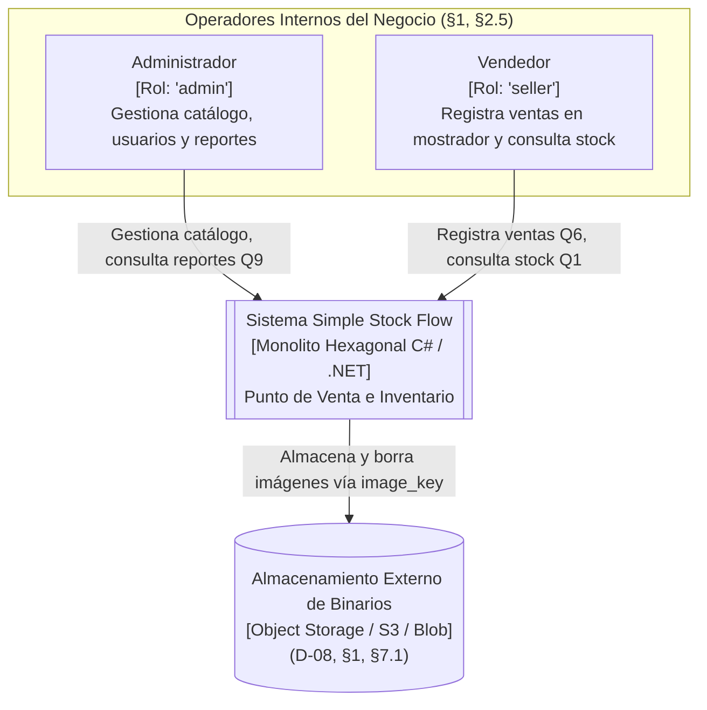

# Arquitectura del Sistema: Visión General (Overview)

> **Documento:** `05-architecture/overview.md`  
> **Sistema:** Simple Stock Flow  
> **Fuente de Verdad Técnica:** [`spec/data-model.md`](../spec/data-model.md)

---

## 1. Estilo Arquitectónico y Justificación

El sistema **Simple Stock Flow** implementa una **Arquitectura Hexagonal (Puertos y Adaptadores)** [citado en §2.5: *"por diseño del hexágono"*; §12: *"src/domain/ de simple-stock-flow-api y src/adapters/outbound/persistence/"*], estructurado como un monolito modular enfocado en las capacidades operativas de catálogo, ventas en mostrador y reportería [citado en §0, §3: esquema único `sales` en la base de datos `simple_stock_flow`].

### Justificación Técnica frente al Modelo de Datos:
1. **Aislamiento del Dominio Puro:** Las reglas críticas de negocio (como el cálculo dinámico del total de la venta `Sale.Total` [§1, Artículo VII], la no repetición de productos en una venta [§2.3] y la inmutabilidad de la venta [§1, §2.3]) se definen en el dominio de C# sin atarse a primitivas del ORM.
2. **Desacoplamiento de Persistencia:** Los nombres de clases de dominio permanecen en singular (`Product`, `Sale`, `SaleItem`, `User`, `Category`) y las colecciones en plural (`Sale.Items`, `DbSet<Product> Products`), mientras que el adaptador de persistencia EF Core traduce transparentemente a las tablas en singular del esquema `sales` (`sales.product`, `sales.sale`, etc.) [§0, §5].
3. **Optimización de Proyecciones:** La consulta del reporte agregado (patrón Q9 [§6.1]) se ejecuta en el motor directamente mediante un puerto de lectura especializado (D-06 [§1]), sin sobrecargar el dominio reconstituyendo grafos de agregados en memoria.

---

## 2. Diagramas C4

### 2.1 C4 Nivel 1: Diagrama de Contexto del Sistema

Muestra los usuarios que interactúan con el sistema y los límites externos. Según el modelo de datos, **no existen clientes externos ni compradores en el sistema** [§1: *"Usuario: operador interno... No hay entidad cliente ni comprador"*; §7: *"no existe dato personal de cliente final: la venta registra al operador interno"*].



---

### 2.2 C4 Nivel 2: Diagrama de Contenedores

Ilustra la infraestructura en tiempo de ejecución, confirmada en el modelo mediante la salida literal de PostgreSQL 16.14 [§10].

```mermaid
graph TB
    subgraph Cliente ["Capa Cliente [Supuesto]"]
        SPA["Aplicación Web / Terminal POS<br/>[HTML / CSS / JavaScript / React o similar]<br/>Ejecutada en navegador de caja"]
    end

    subgraph Backend ["Contenedor de Aplicación"]
        API["simple-stock-flow-api<br/>[C# / .NET 8+ Core]<br/>Núcleo Hexagonal con EF Core<br/>Puerto TCP :5000 / :443 [Supuesto]"]
    end

    subgraph Persistencia ["Contenedores de Datos"]
        DB[("simple-stock-flow-db-1<br/>[PostgreSQL 16.14]<br/>Base: simple_stock_flow<br/>Esquema: sales (Servidor en UTC) (§10)")]
        BLOB[("Servicio de Almacenamiento<br/>[External Storage]<br/>Guarda imágenes referenciadas por image_key (D-08)")]
    end

    SPA -->|HTTP / REST JSON (UTC)| API
    API -->|TCP 5432 / Npgsql / EF Core (SQL 22 columnas)| DB
    API -->|HTTPS SDK Almacenamiento| BLOB
```

---

### 2.3 C4 Nivel 3: Diagrama de Componentes de la API

Detalla la organización interna de `simple-stock-flow-api` en torno a los agregados y puertos deducidos de §2, §6.1 y §12:

```mermaid
graph TB
    subgraph AdaptersIn ["Adaptadores de Entrada (Inbound Adapters)"]
        AUTH_CTRL["AuthController<br/>POST /api/auth/login (Q10) [Supuesto]"]
        PROD_CTRL["ProductController<br/>GET, POST, PUT, DELETE (Q1, Q2) [Supuesto]"]
        SALE_CTRL["SaleController<br/>POST /api/sales (Q3, Q6, Q7) [Supuesto]"]
        REP_CTRL["ReportsController<br/>GET /api/reports/sales (Q9) [Supuesto]"]
    end

    subgraph Application ["Capa de Aplicación (Casos de Uso / Puertos Inbound)"]
        UC_LOGIN["LoginUseCase<br/>Valida credenciales y rol (§2.5)"]
        UC_PROD["ProductManagementUseCases<br/>Create, ChangePrice, SoftDelete (§2.2)"]
        UC_SALE["RecordSaleUseCase<br/>Coordina Sale.AddItem + Product.Withdraw (§2.3)"]
        UC_REP["GetSalesReportUseCase<br/>Ejecuta proyección agregada Q9 (§1, §11.1)"]
    end

    subgraph Domain ["Capa de Dominio Puro (Sin dependencias externas)"]
        PROD_AGG["Agregado Product<br/>Invariante stock >= 0 (ADR-002)<br/>Propiedad sombra xmin (§2.2)"]
        SALE_AGG["Agregado Sale & SaleItem<br/>Composición pura, precios congelados (D-06)<br/>Inmutabilidad histórica (§2.3, §2.4)"]
        USER_AGG["Agregado User<br/>Username normalizado minúsculas (T-20)<br/>Conjunto cerrado 'admin'|'seller' (§2.5)"]
        CAT_ENT["Entidad Category<br/>Solo lectura, 5 filas semilla (§2.1, §9.1)"]
        VO_MONEY["Value Object Money<br/>numeric(18,2), AwayFromZero (§2.2)"]
        VO_QTY["Value Object Quantity<br/>integer > 0 (§2.4)"]
    end

    subgraph AdaptersOut ["Adaptadores de Salida (Outbound Adapters / SPI)"]
        EF_PROD["EfProductRepository<br/>Filtro global deleted_at IS NULL (ADR-003)"]
        EF_SALE["EfSaleRepository<br/>Guarda Sale y SaleItem en 1 Tx"]
        EF_USER["EfUserRepository<br/>Busca por username normalizado (Q10)"]
        EF_CAT["EfCategoryRepository<br/>Solo lectura (Q4, Q5)"]
        SQL_REP["PostgresSalesReportAdapter<br/>GROUP BY product_id, product_name, category_name (Q9, §11.1)"]
        HASH_ADAPT["PasswordHasherAdapter<br/>Genera/valida hash seguro (D-09, §2.5)"]
        IMG_ADAPT["ImageStorageAdapter<br/>Gestiona clave opaca image_key (D-08, §7.1)"]
    end

    AUTH_CTRL --> UC_LOGIN
    PROD_CTRL --> UC_PROD
    SALE_CTRL --> UC_SALE
    REP_CTRL --> UC_REP

    UC_LOGIN --> USER_AGG & HASH_ADAPT & EF_USER
    UC_PROD --> PROD_AGG & CAT_ENT & EF_PROD & IMG_ADAPT
    UC_SALE --> SALE_AGG & PROD_AGG & VO_MONEY & VO_QTY & EF_SALE & EF_PROD
    UC_REP --> SQL_REP
```



---

## 3. Topología de Datos en PostgreSQL

La persistencia del sistema está gobernada exclusivamente por las **migraciones de Entity Framework Core** [ADR-001, §3.2], verificadas en el catálogo de PostgreSQL 16.14 [§10]:

* **Base de datos:** `simple_stock_flow`
* **Esquema:** `sales`
* **Tablas en singular:** `category`, `product`, `sale`, `sale_item`, `user` [§0, §3].
* **22 Columnas Físicas Totales:** Ninguna columna cuenta con valor por defecto (`DEFAULT`) en el motor [§3: *"los valores los pone el dominio, nunca el motor"*].
* **Ausencia de Columnas Forenses de Auditoría:** El sistema **no incluye** `created_at` ni `updated_at` en ninguna tabla [§8]. El único instante de negocio es `sale.sold_at` (UTC) y la única transición de estado rastreada es `product.deleted_at` (baja lógica, T-09).
* **Ausencia de Columna de Moneda:** El sistema es monomoneda por construcción (D-05 [§1, §3]). No existe `currency` en ninguna tabla.

---

## 4. Concurrencia Optimista de Stock mediante `xmin` [§2.2, §3, D-04, T-10]

El punto de mayor contención de la aplicación ocurre durante el patrón de acceso **Q3** (lectura en lote de productos para descontar stock en caja) [§6.1].

### Mecanismo de Resolución:
1. En PostgreSQL, cada fila posee la columna interna de sistema `xmin`, que registra el identificador de la transacción que la modificó por última vez [§3].
2. Entity Framework Core expone `xmin` como **propiedad sombra de concurrencia** en la entidad `Product` [T-10, §2.2].
3. Cuando un operador intenta registrar una venta con `Product.Withdraw(qty)`:
   ```sql
   UPDATE sales.product 
   SET stock = stock - @qty 
   WHERE id = @id AND xmin = @originalXmin;
   ```
4. Si dos vendedores intentan vender simultáneamente la última unidad de un producto:
   * La primera transacción actualiza el stock y avanza el `xmin`.
   * La segunda transacción encuentra que `xmin` ya no coincide; el motor actualiza 0 filas.
   * EF Core arroja `DbUpdateConcurrencyException`.
   * El caso de uso aborta la venta limpiamente, notificando al vendedor sin corromper el inventario y sin recurrir a bloqueos pesimistas de tabla.
5. **Red de Seguridad Final:** Si por alguna vía manual o concurrente la operación superara la guarda de C#, el motor PostgreSQL dispara la restricción `CHECK ((stock >= 0))` (`ck_product_stock_non_negative`) abortando la operación [ADR-002, §4, §10.2].

---

## 5. Estrategia de Almacenamiento y Ciclo de Vida de Imágenes [D-08, §1, §7.1]

* `product.image_key` (`varchar(512)`, nulable) guarda una clave opaca del archivo externo, **nunca una ruta de disco ni los bytes del binario** [§1, §3].
* Si un producto no tiene imagen, el valor es explícitamente `NULL`, nunca una cadena vacía [§1, §2.2].
* **Protocolo de Eliminación Segura [§7.1]:**
  1. Al cambiar la imagen o eliminar el producto, se ejecuta primero el `UPDATE sales.product SET image_key = NULL` en base de datos y se hace *commit*.
  2. Una vez confirmado en PostgreSQL, se envía la instrucción de borrado físico al storage externo.
  * *Razón arquitectónica:* Se evita el riesgo de imágenes rotas en catálogo. Un binario huérfano en storage es inocuo; una clave en base de datos apuntando a un archivo ya borrado rompe la experiencia de usuario.
