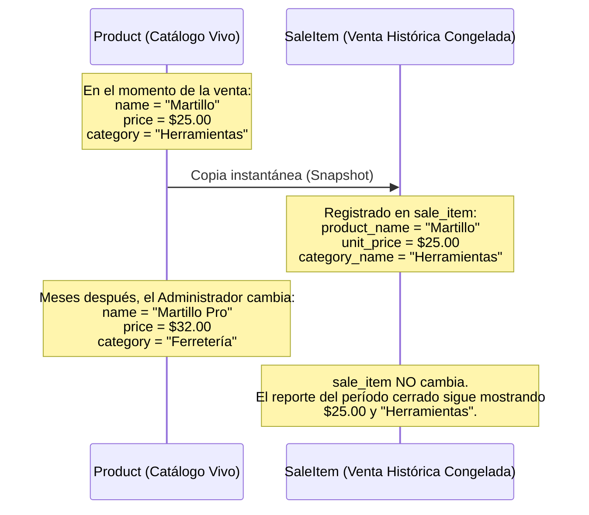

# Guía de Patrones Arquitectónicos y Distribución de Reglas

> **Documento:** `05-architecture/pattern-guide.md`  
> **Sistema:** Simple Stock Flow  
> **Fuente de Verdad Técnica:** [`spec/data-model.md`](../spec/data-model.md)

---

## 1. Dónde Vive Cada Regla: Matriz Exhaustiva (Motor vs. Dominio)

La filosofía técnica de Simple Stock Flow [§preámbulo, §4] exige delimitar con absoluta transparencia qué reglas están respaldadas por el motor PostgreSQL y cuáles dependen exclusivamente de la aplicación en C#.

### Las Tres Marcas del Sistema [§preámbulo, §4]:
* **`motor`**: Existe en PostgreSQL actualmente. Cualquier `INSERT` manual por consola `psql` la respeta o falla.
* **`solo dominio`**: La garantiza el código de C#. Un `INSERT` por consola SQL se la salta sin emitir error.
* **`pendiente`**: Trabajo planificado en tareas técnicas que aún no ha bajado al motor de base de datos.

### Matriz Completa de Reglas del Sistema [§4, §10.2]:

| # | Regla de Negocio / Invariante | Objeto en el Motor (PostgreSQL) | Expresión en C# (Dominio / Hexágono) | Clasificación Oficial | Tarea / Referencia |
| :---: | :--- | :--- | :--- | :---: | :--- |
| **R-01** | Claves primarias únicas en las 5 tablas | `PK_category`, `PK_product`, `PK_sale`, `PK_sale_item`, `PK_user` | Identidad de entidades | **`motor`** | §4, §10.2 |
| **R-02** | `category.name` único | `IX_category_name` (índice único) | — (Solo lectura) | **`motor`** | §2.1, §4, §10.3 |
| **R-03** | `user.username` único | `IX_user_username` (índice único) | Validación en alta | **`motor`** | §2.5, §4, §10.3 |
| **R-04** | Producto atado a categoría existente (`ON DELETE RESTRICT`) | `FK_product_category_category_id` | `Product.SetCategory` | **`motor`** | §5 (FK-1), §10.2 |
| **R-05** | Línea atada a su venta (`ON DELETE CASCADE`) | `FK_sale_item_sale_sale_id` | Composición interna `SaleItem` | **`motor`** | §5 (FK-2), §10.2 |
| **R-06** | Stock físico nunca negativo (`stock >= 0`) | `ck_product_stock_non_negative` | `Product.Withdraw` | **`motor`** | ADR-002, §4, §10.2 |
| **R-07** | Precio de producto estrictamente positivo (`price > 0`) | — *(Baja en T-20)* | `Product.ChangePrice` | **`solo dominio`** | §2.2, §4 |
| **R-08** | Cantidad de venta estrictamente positiva (`quantity > 0`) | — *(Baja en T-20)* | Constructor de `Quantity` | **`solo dominio`** | §2.4, §4 |
| **R-09** | Nombre de categoría obligatorio y no vacío | — *(Baja en T-20)* | `Category.Rename` | **`solo dominio`** | §2.1, §4 |
| **R-10** | Rol de usuario en conjunto cerrado `('admin','seller')` | — *(Baja en T-20)* | `Roles.IsValid` | **`solo dominio`** | §2.5, §4 |
| **R-11** | Nombre de usuario en minúsculas y sin espacios | — *(Baja en T-20)* | `User.NormalizeUsername` | **`solo dominio`** | §2.5, §4 |
| **R-12** | Línea de venta requiere venta obligatoria (`sale_id NOT NULL`) | Columna `sale_item.sale_id NOT NULL` | Composición | **`motor`** | T-20, §4, §13 D-2 |
| **R-13** | Producto no se repite en la misma venta | `IX_sale_item_sale_id_product_id` (Único con `INCLUDE`) | `Sale.AddItem` | **`motor`** | T-20, §2.3, §4 |
| **R-14** | Línea de venta referencia producto existente (`ON DELETE RESTRICT`)| `FK_sale_item_product_product_id` | `Sale.AddItem` | **`motor`** | ADR-003, T-20, §5 (FK-3) |
| **R-15** | Descontar stock y registrar línea en una sola operación atómica | Transacción ACID en motor | `Sale.AddItem` + `Product.Withdraw` | **`solo dominio`** | §2.3 |
| **R-16** | Venta inmutable (no modificable ni eliminable) | Sin permisos de UPDATE/DELETE | Ausencia de métodos en API | **`solo dominio`** | §1, §2.3, §7.1 |
| **R-17** | Venta requiere al menos una línea para confirmarse | — | `Sale.EnsureConfirmable` | **`solo dominio`** | §2.3 |
| **R-18** | Autoría de venta atada a usuario (`ON DELETE RESTRICT`) | — | `Sale.SoldBy` | **`pendiente`** | T-12, §3, §5 (FK-4) |

---

## 2. Patrones Tácticos de Dominio (Domain-Driven Design)

### 2.1 Patrón Aggregate Root (Raíz de Agregado)
El sistema encapsula sus límites transaccionales en torno a **tres raíces de agregado**:

```
┌────────────────────────────────────────────────────────┐
│                   AGREGADO PRODUCT                     │
│  Raíz: Product                                         │
│  Límite: Control exclusivo de existencias físicas      │
│  Defensa: ck_product_stock_non_negative + xmin (D-04)  │
└────────────────────────────────────────────────────────┘

┌────────────────────────────────────────────────────────┐
│                     AGREGADO SALE                      │
│  Raíz: Sale                                            │
│  Entidad Interna: SaleItem                             │
│  Límite: Total de la venta y composición de renglones  │
│  Defensa: FK en cascada + unicidad (sale_id, prod_id)  │
└────────────────────────────────────────────────────────┘

┌────────────────────────────────────────────────────────┐
│                     AGREGADO USER                      │
│  Raíz: User                                            │
│  Límite: Credenciales del operador y privilegios       │
│  Defensa: IX_user_username + Normalización minúsculas │
└────────────────────────────────────────────────────────┘
```

* **Regla de Oro del Agregado [§2]:** Las transacciones no cruzan los límites de agregado de forma arbitraria. La única operación coordinada ocurre al invocar `Sale.AddItem`, donde `Sale` interactúa con `Product` para retirar existencias antes de añadir la línea, persistiendo ambos agregados en la misma unidad de trabajo de EF Core [§2.3].

---

### 2.2 Patrón Value Object (Objeto de Valor)

Los objetos de valor son inmutables y carecen de identidad propia; viven dentro de la fila de su entidad dueña en PostgreSQL (D-07 [§2]):

#### `Money` [§1, §2.2]
* **Representación en Base de Datos:** Columna física `numeric(18,2)` en `product.price` y `sale_item.unit_price`.
* **Regla de Redondeo [§2.2]:** Redondea estrictamente a **2 decimales usando `MidpointRounding.AwayFromZero`** antes de persistir.
* **Monomoneda:** No posee atributo de divisa. Todas las operaciones monetarias del sistema asumen la misma divisa por construcción (D-05 [§1, §3]).
* **Aceptación de Cero:** El constructor de `Money` rechaza importes negativos pero admite 0 (`new Money(0)` es válido). Por ello, la regla de catálogo `price > 0` es custodiada por `Product.ChangePrice` [§2.2].

#### `Quantity` [§1, §2.4]
* **Representación en Base de Datos:** Columna física `integer` en `sale_item.quantity`.
* **Invariante:** Entero estrictamente positivo (`quantity > 0`).

---

### 2.3 Patrón *Frozen Snapshot* (Datos Congelados en la Venta) [D-06, ADR-004, §1, §2.4]

En un sistema de facturación y punto de venta, los datos del catálogo comercial están vivos (cambian de precio, se corrigen nombres, se recategorizan artículos). Sin embargo, una venta es un **hecho contable inmutable**.



#### Justificación frente al Modelo [§1, §2.4, §11.1]:
* `sale_item` guarda copias congeladas de `product_name` (`varchar(200)`), `unit_price` (`numeric(18,2)`) y `category_name` (`varchar(120)`).
* `category_name` en `sale_item` **no tiene clave foránea hacia la tabla `category` de forma deliberada** [ADR-004, §2.4, §3]: si tuviera clave foránea, renombrar una categoría reescribiría el histórico comercial.
* **Resolución del Reporte Q9 [§11.1 H-1]:** Ante recategorizaciones en el tiempo, el reporte de ventas agrupa directamente por el `category_name` congelado en cada línea de venta. Así, un período cerrado jamás muta.

---

### 2.4 Patrón Baja Lógica (*Soft Delete*) [ADR-003, T-09, §2.2]

* Los productos del catálogo **nunca se eliminan físicamente** de PostgreSQL con una sentencia `DELETE` [§2.2, §7.1].
* **Implementación:** Propiedad sombra `deleted_at` (`timestamptz`, nulable) en `sales.product`.
* **Filtro Global en EF Core:** Las consultas de búsqueda de catálogo (Q1) y carga de productos para venta (Q3) aplican automáticamente `WHERE deleted_at IS NULL`.
* **Interacción con Claves Foráneas [§5 FK-3]:** La clave foránea `FK_sale_item_product_product_id` posee acción `ON DELETE RESTRICT`. Si por error administrativo alguien ejecutase un borrado SQL manual sobre un producto que ya registra ventas, PostgreSQL rechaza la operación inmediatamente, preservando la integridad referencial.

---

## 3. Política Integral de Claves Foráneas [§5]

El sistema establece cuatro relaciones estructurales con sus correspondientes políticas de eliminación:

| # | Clave Foránea | Tabla Origen | Tabla Destino | Acción `ON DELETE` | Acción `ON UPDATE` | Estado en Motor [§5, §10.2] | Justificación Técnica de la Acción |
| :---: | :--- | :--- | :--- | :---: | :---: | :---: | :--- |
| **FK-1** | `FK_product_category_category_id` | `sales.product` | `sales.category` | **`RESTRICT`** | `NO ACTION` | **`motor`** | Una categoría que tenga productos asociados no puede eliminarse de la base de datos. |
| **FK-2** | `FK_sale_item_sale_sale_id` | `sales.sale_item` | `sales.sale` | **`CASCADE`** | `NO ACTION` | **`motor`** | Composición pura del agregado: una línea no tiene sentido de existencia sin su venta cabecera. |
| **FK-3** | `FK_sale_item_product_product_id` | `sales.sale_item` | `sales.product` | **`RESTRICT`** | `NO ACTION` | **`motor`** *(T-20)* | Barrera final de defensa: impide que un borrado físico en base de datos deje huérfana una venta o destruya el reporte histórico comercial. |
| **FK-4** | `FK_sale_user_sold_by_user_id` | `sales.sale` | `sales.user` | **`RESTRICT`** | `NO ACTION` | **`pendiente`** *(T-12)* | La autoría contable de una venta es un registro legal auditable; un usuario que haya efectuado ventas no puede borrarse físicamente. |

> **Nota sobre `ON UPDATE NO ACTION` [§5]:** Todas las claves primarias son identificadores inmutables de tipo UUID generados en la aplicación. No existe ningún caso de uso de actualización de clave primaria, por lo que `CASCADE` en `UPDATE` constituiría maquinaria redundante y riesgosa.
